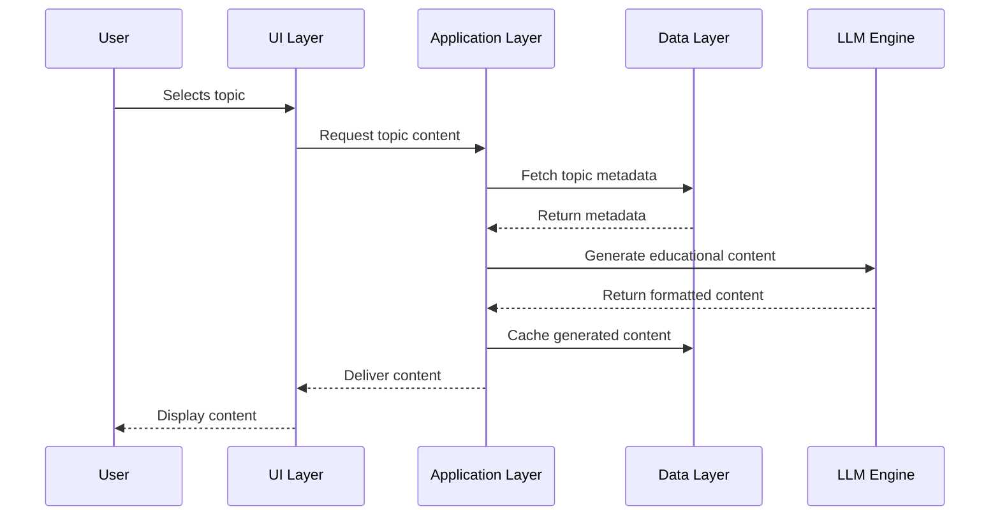

# SuguruAI: Technical Architecture Document

This document outlines the technical architecture of SuguruAI, providing a comprehensive overview of the system components, their interactions, and the technology stack.

## 1. System Overview

### 1.1 Architecture Diagram

```
┌───────────────────────────────────────────────────────────────────┐
│                        SuguruAI Application                        │
├───────────┬───────────────────────────────────┬───────────────────┤
│           │                                   │                   │
│  ┌────────▼──────────┐     ┌─────────────────▼─────┐  ┌──────────▼────────┐
│  │                   │     │                       │  │                    │
│  │  UI Layer         │     │  Application Layer    │  │  Data Layer        │
│  │  (Streamlit)      │     │  (Python)            │  │  (SQLite)           │
│  │                   │     │                       │  │                    │
│  └────────┬──────────┘     └─────────────────┬─────┘  └──────────┬────────┘
│           │                                   │                   │
│           └───────────────┬───────────────────┘                   │
│                           │                                       │
│                   ┌───────▼───────┐                               │
│                   │               │                               │
│                   │  LLM Engine   ◄───────────────────────────────┘
│                   │  (llama.cpp)  │
│                   │               │
│                   └───────────────┘
│                                                                   │
└───────────────────────────────────────────────────────────────────┘
```

### 1.2 Key Design Principles

1. **Offline-First**: The entire application functions without internet connectivity
2. **Resource Efficiency**: Optimized for low-resource environments
3. **Modular Design**: Components are decoupled for easier maintenance and extension
4. **Educational UX**: User experience optimized for learning environments
5. **Cultural Relevance**: Content and interactions tailored to Ghanaian context

## 2. Component Architecture

### 2.1 UI Layer

The user interface layer is built using Streamlit and is responsible for all user interactions.

#### 2.1.1 Components

- **Navigation System**: Manages application flow between pages
- **Content Renderer**: Displays educational content with formatting
- **Interactive Elements**: Quiz widgets, buttons, progress indicators
- **State Management**: Handles user session state within Streamlit

#### 2.1.2 Pages

- **Home Page**: Entry point with subject selection and progress overview
- **Subject Browser**: Hierarchical view of educational subjects and topics
- **Learning Session**: Sequential content presentation with navigation controls
- **Assessment Page**: Quiz interface with question rendering and evaluation
- **Progress Tracker**: Visualizations of learning progress and achievements

#### 2.1.3 UI State Management

```python
# Streamlit session state structure
st.session_state = {
    "user_id": str,                       # Unique user identifier
    "current_subject": int,               # Current subject ID
    "current_topic": int,                 # Current topic ID
    "current_section": int,               # Current section within topic
    "progress": Dict[str, Any],           # Progress data
    "assessment_results": Dict[str, Any], # Latest assessment results
    "ui_preferences": Dict[str, Any]      # User interface preferences
}
```

### 2.2 Application Layer

The application layer contains the business logic and orchestrates the interactions between UI and data layers.

#### 2.2.1 Core Services

- **Session Manager**: Controls the learning session flow and state
- **Content Service**: Retrieves and processes syllabus content
- **Assessment Service**: Generates and evaluates knowledge assessments
- **Progress Tracker**: Monitors and records user learning progress
- **Personalization Engine**: Adapts content based on user performance

#### 2.2.2 Service Interactions



### 2.3 Data Layer

The data layer handles all persistence operations and data access.

#### 2.3.1 Database Schema

See Feature Specification Document section 2.1.1 for detailed schema design.

#### 2.3.2 Data Access Patterns

- **Content Access**: Read-heavy access to syllabus and educational content
- **Progress Tracking**: Frequent small writes for user progress updates
- **Assessment Records**: Batch writes after assessment completion
- **Caching**: Temporary storage of LLM-generated content

#### 2.3.3 Data Flow

```
┌──────────────┐     ┌──────────────┐     ┌────────────┐
│              │     │              │     │            │
│ Raw Syllabus │────►│ Preprocessed │────►│ SQLite DB  │
│ Content      │     │ Content      │     │            │
│              │     │              │     │            │
└──────────────┘     └──────────────┘     └─────┬──────┘
                                                │
                                                │
┌──────────────┐     ┌──────────────┐     ┌─────▼──────┐
│              │     │              │     │            │
│ UI Rendering │◄────┤ Application  │◄────┤ Query      │
│              │     │ Logic        │     │ Processing │
│              │     │              │     │            │
└──────────────┘     └──────────────┘     └────────────┘
```

### 2.4 LLM Engine

The LLM engine handles all interactions with the Llama 2 model.

#### 2.4.1 Components

- **Model Manager**: Loads and manages the LLM in memory
- **Inference Engine**: Processes prompts and generates responses
- **Context Manager**: Handles prompt construction and context window
- **Output Processor**: Post-processes LLM outputs for consistency

#### 2.4.2 Integration Interfaces

- **Direct API**: Python function calls from application layer
- **Template System**: Standardized templates for different content types
- **Batching System**: Efficient batching of related content generation

## 3. Technology Stack

### 3.1 Frontend Technologies

- **Primary Framework**: Streamlit 1.22+
- **UI Extensions**: streamlit-extras, st-annotated-text, streamlit-option-menu
- **Styling**: Custom CSS, Material Design principles
- **Visualizations**: Matplotlib, Plotly, Streamlit native charts

### 3.2 Backend Technologies

- **Language**: Python 3.9+
- **LLM Framework**: llama.cpp via llama-cpp-python bindings
- **Database**: SQLite 3
- **Content Processing**: NLTK, Pandas, NumPy
- **API Layer**: FastAPI (for potential future extensions)

### 3.3 Model Technologies

- **Base Model**: Llama 2 7B (GGUF format)
- **Fine-tuning**: PEFT with LoRA
- **Quantization**: GGML/GGUF 4-bit quantization
- **Inference Optimization**: llama.cpp with CPU optimizations

### 3.4 Development & Deployment

- **Version Control**: Git
- **Dependency Management**: Poetry or Pip requirements.txt
- **Packaging**: PyInstaller with UPX compression
- **Testing**: Pytest, Streamlit testing utilities
- **Documentation**: MkDocs with Material theme

## 4. System Behaviors

### 4.1 Startup Sequence

1. Application initialization
2. Database connection and schema validation
3. User identification (create new or load existing)
4. Lazy loading of UI components
5. Delayed loading of LLM (on first content request)
6. Presentation of home screen

### 4.2 Content Generation Flow

1. User selects topic for learning
2. Application checks for cached content
3. If not cached, retrieve syllabus metadata
4. Construct appropriate prompt with syllabus context
5. Submit to LLM engine for generation
6. Post-process and format response
7. Cache generated content
8. Present to user in sequential sections

### 4.3 Assessment Sequence

1. User completes learning content and initiates assessment
2. Application retrieves learning objectives for topic
3. Generate assessment questions (from templates or LLM)
4. Present questions sequentially to user
5. Process user responses and provide feedback
6. Calculate overall score and identify weak areas
7. Store assessment results in user profile
8. Generate recommendations for further study

### 4.4 Error Handling

- **LLM Failures**: Fallback to pre-generated content
- **Database Errors**: In-memory operation with deferred persistence
- **Resource Limitations**: Adaptive resource usage based on system capabilities
- **Content Issues**: User feedback mechanism for flagging problematic content

## 5. Performance Considerations

### 5.1 Memory Management

- **LLM Loading**: Approximately 4GB RAM required for 4-bit quantized model
- **Context Window**: 4096 tokens (adjustable based on hardware)
- **Resource Monitoring**: Dynamic adjustment of batch sizes and context length
- **Garbage Collection**: Explicit GC after large operations

### 5.2 Storage Requirements

- **Base Application**: ~100MB (excluding model)
- **LLM Model**: ~4GB (quantized)
- **Syllabus Data**: ~50MB
- **User Data**: ~10MB per user
- **Total Minimum**: ~5GB disk space

### 5.3 Performance Targets

- **Application Startup**: < 5 seconds (excluding model load)
- **Model First Load**: < 30 seconds on target hardware
- **Content Generation**: < 5 seconds per segment
- **UI Responsiveness**: < 100ms for navigation actions
- **Memory Footprint**: < 8GB RAM total usage

## 6. Security & Privacy

### 6.1 Data Security

- **User Data**: Stored locally only, no cloud transmission
- **Database Security**: SQLite encryption for user progress data
- **Model Protection**: Integrity validation of model files

### 6.2 Privacy Considerations

- **Data Collection**: Only essential learning progress data
- **Analytics**: Anonymized usage data, opt-in only
- **Content**: No storage of user-generated content outside session

## 7. Future Extensibility

### 7.1 Extension Points

- **Plugin Architecture**: Future support for educational content plugins
- **Model Swapping**: Ability to upgrade or change base LLM
- **Content Sources**: Additional syllabus sources beyond GES
- **Synchronization**: Optional cloud backup of progress (future)

### 7.2 API Design

The internal API is designed to support future extensions:

```python
# Core service interfaces

class ContentService:
    def get_topic_content(topic_id: int) -> Dict[str, Any]: ...
    def get_subject_structure(subject_id: int) -> List[Dict]: ...
    
class LLMService:
    def generate_content(prompt: str, params: Dict[str, Any]) -> str: ...
    def evaluate_answer(question: str, answer: str) -> Dict[str, Any]: ...
    
class ProgressService:
    def update_progress(user_id: str, topic_id: int, data: Dict) -> None: ...
    def get_user_progress(user_id: str) -> Dict[str, Any]: ...
```

## 8. Appendix

### 8.1 Environment Requirements

- **Operating System**: Windows 10+ (primary), Ubuntu 20.04+ (secondary)
- **Processor**: x86-64 with AVX2 support (recommended)
- **Memory**: 8GB RAM minimum, 16GB recommended
- **Storage**: 10GB free space
- **Python**: 3.9+

### 8.2 Development Setup

```bash
# Clone repository
git clone https://github.com/organization/suguruai.git
cd suguruai

# Create virtual environment
python -m venv venv
source venv/bin/activate  # On Windows: venv\Scripts\activate

# Install dependencies
pip install -r requirements.txt

# Run development server
cd app
streamlit run main.py
```

### 8.3 Deployment Package

```
SuguruAI-Installer/
├── SuguruAI.exe           # Main application executable
├── models/                # Pre-packaged model files
│   └── llama2-7b-ges.gguf # Quantized and tuned model
├── data/                  # Initial database and content
│   └── syllabus.db        # Pre-populated syllabus database
└── README.txt             # Installation instructions
``` 